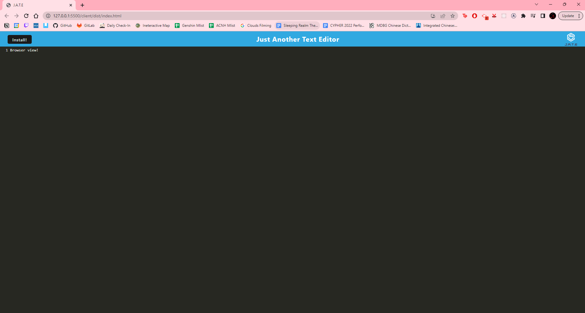
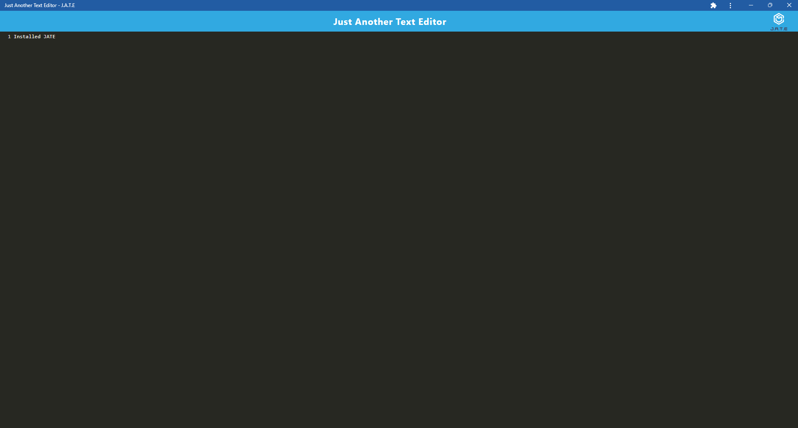

# JATE Text Editor []

  ## Description

  The Just Another Text Editor (JATE) is a PWA text editor with JavaScript syntax highlighting. As JATE is a PWA, it can be used on the browser or installed to one's device to be used without internect connection. 

  The JATE has been converted into a PWA, and before operated as a regular web application. As JATE is now a PWA, it has offline functionality, has better performance, and can be downloaded to a user's device. 

  Upon directing yourself to the [deployed link](), a user should be greeted by this window: 

  After downloading, JATE should look like this: 

  ---
  ## Table of Contents 

  - [Installation](#instlalation)
  - [Usage](#usage)
  - [License](#license) 
  - [Contributing](#contributing)
  - [Tests](#tests)
  ---

  ## Installation

  For commercial use, simply install JATE with the install button in the browser. Please follow standard installation protocol (such as finding where to download it in  your device.)

  For developer use, one should clone this repo and install all dependencies, minding all of `package.json`s in the client, server, and root directories. 

  ## Usage 

  If not installed, please visit the [deployed link](). From there, one may either choose to install JATE or use it in the browser. 

  ## License
  
  [License: MIT](https://opensource.org/licenses/MIT)
  
  Copyright 2023 Anna Langford
  
  Permission is hereby granted, free of charge, to any person obtaining a copy of this software and associated documentation files (the "Software"), to deal in the Software without restriction, including without limitation the rights to use, copy, modify, merge, publish, distribute, sublicense, and/or sell copies of the Software, and to permit persons to whom the Software is furnished to do so, subject to the following conditions:
  
  The above copyright notice and this permission notice shall be included in all copies or substantial portions of the Software.
  
  THE SOFTWARE IS PROVIDED "AS IS", WITHOUT WARRANTY OF ANY KIND, EXPRESS OR IMPLIED, INCLUDING BUT NOT LIMITED TO THE WARRANTIES OF MERCHANTABILITY, FITNESS FOR A PARTICULAR PURPOSE AND NONINFRINGEMENT. IN NO EVENT SHALL THE AUTHORS OR COPYRIGHT HOLDERS BE LIABLE FOR ANY CLAIM, DAMAGES OR OTHER LIABILITY, WHETHER IN AN ACTION OF CONTRACT, TORT OR OTHERWISE, ARISING FROM, OUT OF OR IN CONNECTION WITH THE SOFTWARE OR THE USE OR OTHER DEALINGS IN THE SOFTWARE.

  ## Contributing

  No other developers contributed to this application. 

  ## Tests

  This application has no tests.
